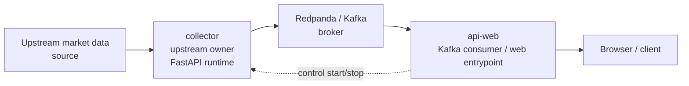
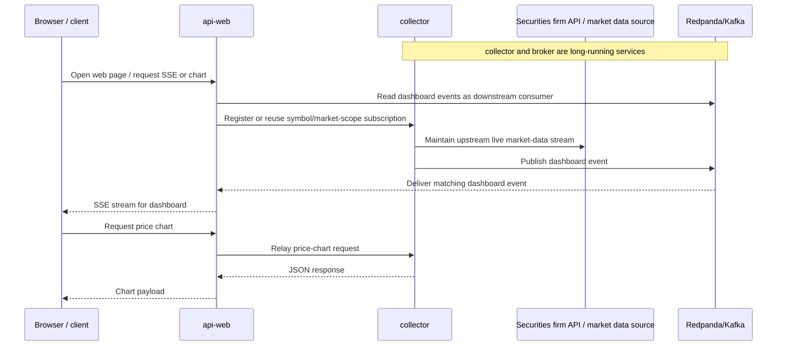

# ksxt

`ksxt`는 국내 증권사 시세 데이터를 받아 실시간으로 수집하고, 다른 프로그램이나 브라우저에서 활용할 수 있게 전달하는 오픈소스 프로젝트입니다.

현재 공개 저장소에서 실제로 동작하는 라이브 수집 경로는 **한국투자증권(KIS) 자격 증명**을 사용하는 방식입니다. 장기적으로는 특정 증권사에 묶이지 않는 구조를 지향하지만, 지금 단계의 사용 기준은 KIS 연동이라고 보는 것이 가장 정확합니다.

## 무엇을 하는 프로젝트인가요?

이 저장소는 국내 주식 시장 데이터를 다음과 같은 흐름으로 다룹니다.

- 실시간 시세를 수집합니다.
- 수집한 이벤트를 메시지 브로커(Redpanda)로 전달합니다.
- SSE와 HTTP 엔드포인트로 데이터를 조회할 수 있게 제공합니다.
- 간단한 웹 화면에서 실시간 흐름을 확인할 수 있습니다.

즉, 이 프로젝트는 **국내 증권/시장 데이터 수집, 스트리밍, 조회를 위한 개발용 기반 저장소**에 가깝습니다. 별도의 웹 대시보드 제품이나 완성형 분석 플랫폼을 목표로 소개하는 단계는 아닙니다.

## 현재 지원 범위

공개 저장소 기준으로 현재 확인 가능한 기능은 아래와 같습니다.

- **KIS 기반 실시간 데이터 수집**
- 종목 코드와 시장 범위(scope) 기준 브라우저 SSE 스트림 구독 (`krx`, `nxt`, `total`)
- 가격 차트 조회용 HTTP API
- 브라우저에서 확인할 수 있는 기본 웹 화면
- Docker Compose 기반 로컬 실행 환경

현재 사용 시 가장 중요한 전제는 다음 두 가지입니다.

1. 라이브 데이터 경로는 KIS 자격 증명이 있어야 동작합니다.
2. 저장소 전체가 범용 증권 데이터 플랫폼으로 완성된 상태는 아닙니다.

## 구성 요소

사용자와 기여자가 이해해야 할 최소 구성만 정리하면 다음과 같습니다.

- `collector`: KIS와 연결해 실시간 데이터를 받아오고, 대시보드 이벤트를 Redpanda로 발행하며, 제어용 구독 엔드포인트와 `/api/price-chart`, `/health`를 제공합니다.
- `api-web`: Redpanda의 대시보드 이벤트를 소비해 브라우저 SSE로 전달하고, `src/web/` 정적 프런트엔드를 제공합니다.
- `redpanda`: 실시간 이벤트를 전달하는 메시지 브로커입니다.
- `processor`: Compose에 포함되어 있지만 아직 최소 수준의 서비스입니다.
- `clickhouse`: 향후 저장/분석 확장을 위한 구성 요소로 포함되어 있습니다.

## 시스템 아키텍처

현재 공개 저장소 기준의 실제 라이브 경로는 **collector가 업스트림 시장 데이터 소스 연결을 담당**하고, 그 이벤트를 Redpanda로 발행한 뒤 `api-web`이 Redpanda를 소비해 브라우저로 전달하는 구조입니다.



실시간 조회 흐름을 사용자 관점에서 단순화하면 아래와 같습니다. 핵심은 **collector와 Redpanda가 먼저 살아 있는 런타임**이고, `api-web`은 그 하류에서 소비·중계한다는 점입니다. 브라우저 요청은 필요한 종목 구독을 등록하거나 이미 흐르는 데이터를 붙여 받는 역할이지, 브로커나 전체 이벤트 시스템 자체를 기동하는 것은 아닙니다.



## 로컬에서 실행하기

### 1) Python 가상환경 준비

```bash
python3 -m venv .venv
source .venv/bin/activate
pip install -r requirements.txt
```

### 2) 환경 변수 준비

실제 자격 증명은 로컬 `.env` 파일에만 두고, 저장소에는 커밋하지 마세요.

자주 사용하는 설정 예시는 아래와 같습니다.

- `APP_ENV`
- `APP_HOST`
- `APP_PORT`
- `BOOTSTRAP_SERVERS`
- `CLICKHOUSE_URL`
- `SYMBOL`
- `MARKET`
- `POLL_INTERVAL_SECONDS`
- `COLLECTOR_BASE_URL`

KIS 라이브 연동에는 아래 값이 필요합니다.

- `KIS_APP_KEY`
- `KIS_APP_SECRET`
- `KIS_HTS_ID`
- `KIS_REST_URL`
- `KIS_WS_URL`
- `KIS_BYPASS_PROXY`

유효한 KIS 자격 증명이 없으면 실시간 수집은 재현할 수 없습니다.

### 3) Redpanda 실행

```bash
docker compose up -d redpanda
```

로컬 Python 프로세스 기준 기본 브로커 주소는 `localhost:19092`입니다.

### 4) collector 실행

```bash
python -m apps.collector.service
```

확인할 수 있는 기본 주소:

- `http://127.0.0.1:8001/health`
- `http://127.0.0.1:8001/api/price-chart?symbol=005930&scope=krx&interval=1`

### 5) 웹 앱 실행

```bash
uvicorn apps.api_web.app:app --reload
```

브라우저 접속 주소:

- `http://127.0.0.1:8000`

`api-web`은 루트에서 `src/web/index.html`을 서빙하고, 같은 디렉터리의 정적 자산을 `/static`으로 제공합니다.

## Docker로 실행하기

전체 스택은 아래 명령으로 실행할 수 있습니다.

```bash
docker compose up --build
```

Compose에는 현재 다음 서비스가 포함됩니다.

- `redpanda`
- `clickhouse`
- `collector`
- `processor`
- `api-web`

Compose 내부에서는 `BOOTSTRAP_SERVERS=redpanda:9092`를 사용합니다.

실행 후 기본 접속 경로는 다음과 같습니다.

- 웹 앱: `http://127.0.0.1:8000`
- collector health: `http://127.0.0.1:8001/health`

## 현재 한계

- 공개 저장소에서 실제 라이브 경로가 확인된 증권사 연동은 현재 **KIS만** 있습니다.
- KIS 자격 증명이 없으면 핵심 기능인 실시간 수집을 직접 확인할 수 없습니다.
- 국내주식 분봉 조회는 현재 KIS `FID_INPUT_HOUR_1`를 국내 정규장 기준 커서로 사용하며, 이 단계에서는 정규장 분봉 조회를 우선으로 맞추고 시간외 세션 의미까지 완전히 해결한 상태는 아닙니다.
- `processor`는 아직 최소 수준의 서비스이며, 후속 처리 파이프라인이 본격적으로 구현된 상태는 아닙니다.
- `clickhouse`는 Compose에 포함되어 있지만 현재 이 라이브 대시보드 경로의 필수 요소는 아닙니다.
- 저장, 분석, 다중 증권사 지원은 아직 확장 중입니다.

## 로드맵

- 지원 가능한 증권사/데이터 소스 확대
- 공통 데이터 모델과 이벤트 형식 정리
- 후속 처리 및 저장 흐름 보강
- 테스트와 운영 문서 보완
- 로컬 개발 환경과 예제 문서 개선

## 문서

- `docs/architecture/overview.md`

## 라이선스

이 프로젝트는 [MIT License](./LICENSE)로 배포됩니다.

## 기여 안내

기여할 때는 현재 실제로 동작하는 범위와 아직 준비 중인 범위를 구분해서 봐주시면 좋습니다.

- 이미 동작하는 로컬 실행 경로를 깨지 않는 변경을 우선합니다.
- 구현되지 않은 기능을 README나 코드에서 완성된 것처럼 설명하지 않습니다.
- 큰 구조 변경보다 검증 가능한 작은 개선을 선호합니다.
